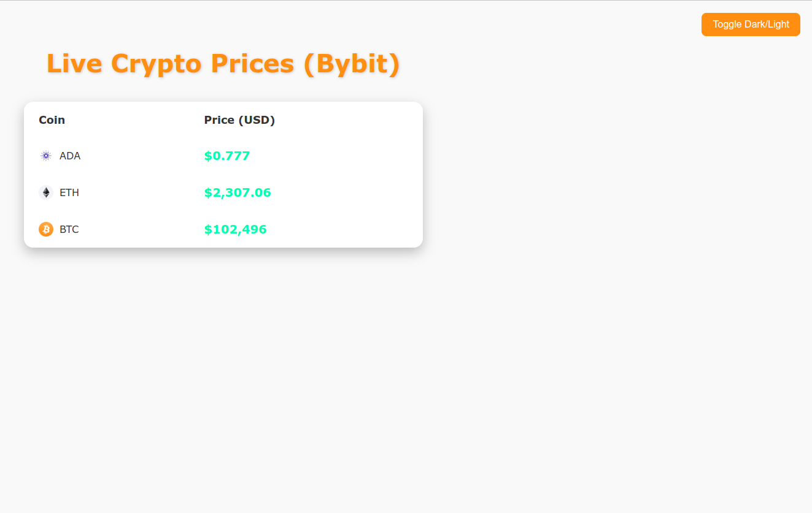
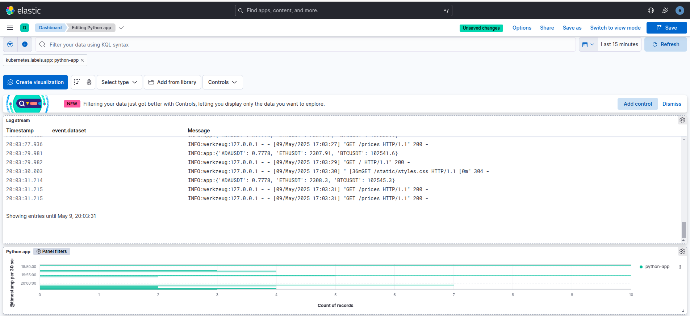

# ELK on Kubernetes with simple Python and Nodejs apps
This is a short but useful project that builds an elk cluster on kubernetes alongside 2 apps (Python and NodeJS)
and collects logs from them with filebeat DaemonSet to logstash Service to elasticsearch Service and visualise them with kibana Service.

### Info
ELK deployed with Helm package manager. 
1. Repo add
2. Repo update
3. Fetch values to configure as we want
```bash
helm repo add elastic https://helm.elastic.co
helm repo update
# e.g fetch values for elasticsearch
# helm show values elastic/elasticsearch > values.yaml (Use this command and compare with existing elasticsearch-values.yaml)
```

### Environment Setup
1. Install minikube, kubectl and helm
```bash
sudo apt update -y
curl -LO https://storage.googleapis.com/minikube/releases/latest/minikube-linux-amd64
sudo install minikube-linux-amd64 /usr/local/bin/minikube
rm minikube-linux-amd64


curl -LO "https://dl.k8s.io/release/$(curl -sL https://dl.k8s.io/release/stable.txt)/bin/linux/amd64/kubectl"
sudo install kubectl /usr/local/bin/kubectl
rm kubectl

curl https://baltocdn.com/helm/signing.asc | sudo gpg --dearmor -o /usr/share/keyrings/helm.gpg
echo "deb [signed-by=/usr/share/keyrings/helm.gpg] https://baltocdn.com/helm/stable/debian/ all main" | \
    sudo tee /etc/apt/sources.list.d/helm-stable-debian.list
sudo apt update -y
sudo apt install -y helm
```
2. Run minikube
```bash
minikube start --cpus=4  --memory=8192 --vm-driver=docker
```
### Install ELK 


```bash
# Install ELK with the following script
bash ./install-elk.sh
# port-forward kibana
kubectl port-forward svc/kibana -n logging  5601
# Retrieve the elasticsearch password to login with kibana (Hint: lookup 10 lines below)


# THESE ARE THE HELM COMMANDS FOR EACH ONE OF THE ELK COMPONENTS
# DO NOT RUN THEM INDIVIDUALLY SINCE THEY ARE INCLUDED IN THE INSTALL I JUST PUT THEM HERE FOR DOCUMENTATION PURPOSES
helm install elk-elasticsearch elastic/elasticsearch -f src/elasticsearch-values.yaml --namespace logging --create-namespace
---
# NOTES:
#1. Watch all cluster members come up.
#  $ kubectl get pods --namespace=logging -l app=elasticsearch-master -w
#2. Retrieve elastic user's password.
#  $ kubectl get secrets --namespace=logging elasticsearch-master-credentials -ojsonpath='{.data.password}' | base64 -d
#3. Test cluster health using Helm test.
#  $ helm --namespace=logging test elk-elasticsearch
---
helm install elk-kibana elastic/kibana -f src/kibana-values.yaml --namespace logging
---
#NOTES:
#1. Watch all containers come up.
#  $ kubectl get pods --namespace=logging -l release=elk-kibana -w
#2. Retrieve the elastic user's password.
#  $ kubectl get secrets --namespace=logging elasticsearch-master-credentials -ojsonpath='{.data.password}' | base64 -d
#3. Retrieve the kibana service account token.
#  $ kubectl get secrets --namespace=logging elk-kibana-kibana-es-token -ojsonpath='{.data.token}' | base64 -d
---
helm install elk-logstash elastic/logstash -f src/logstash-values.yaml --namespace logging
---
#NOTES:
#1. Watch all cluster members come up.
#  $ kubectl get pods --namespace=logging -l app=elk-logstash-logstash -w
---
helm install elk-filebeat elastic/filebeat -f src/filebeat-values.yaml --namespace logging
---
#NOTES:
#  $ kubectl get pods --namespace=logging -l app=elk-filebeat-filebeat -w
---  


```
### Run Python and NodeJS apps
```bash
# Build images
docker build -t local/python-app:latest ./apps/python-app
docker build -t local/nodejs-app:latest ./apps/nodejs-app

# Copy them inside minikube
minikube image load local/python-app:latest
minikube image load local/nodejs-app:latest

# Deploy python and nodejs apps
kubectl apply -f apps/python-app/k8s/.
kubectl apply -f apps/nodejs-app/k8s/.

# Port-forward python-app
kubectl port-forward svc/python-app-service 5000
```

After these steps open your browser 
- [python-app](http:/localhost:5000)
- [kibana](http:/localhost:5000)





